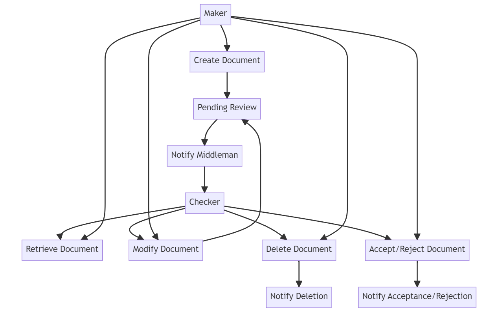
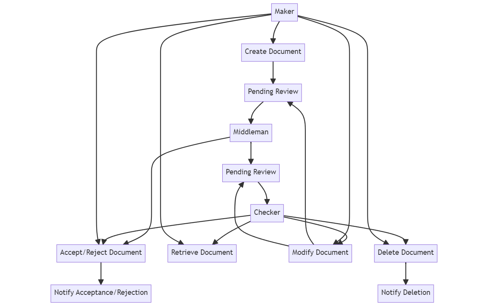
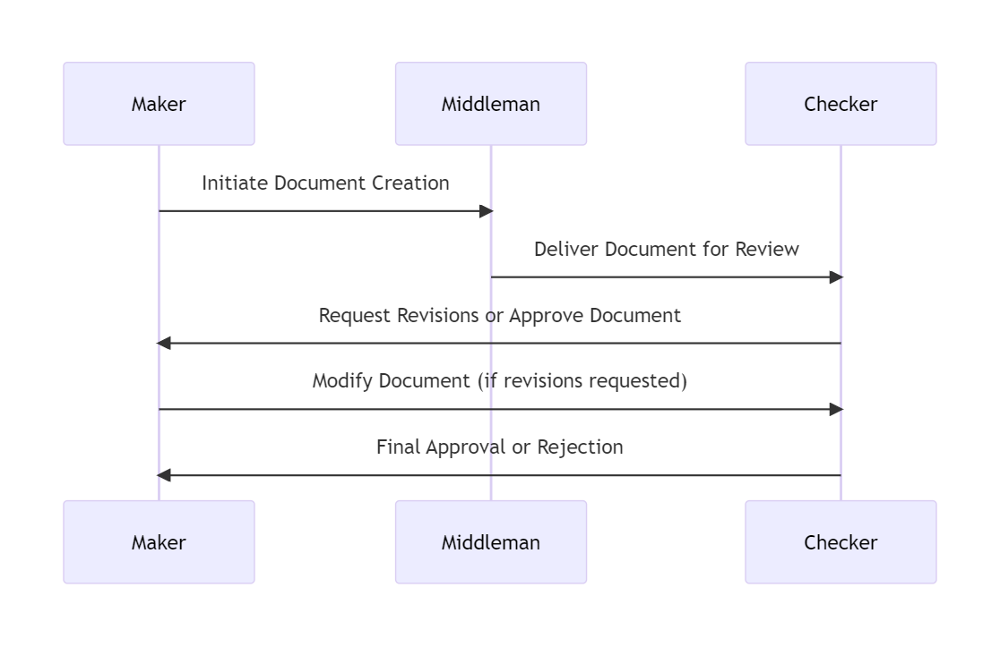
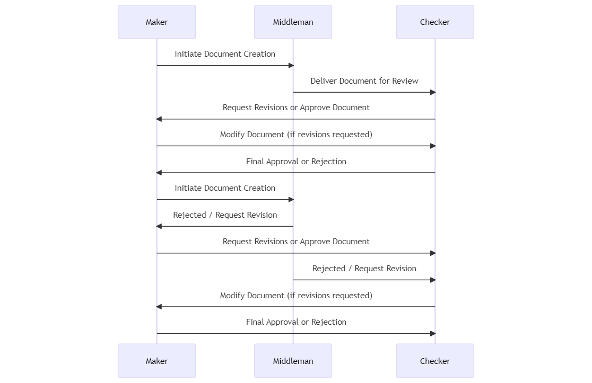

# Jopacc backend task

We kindly request that you develop a Node.js application that implements a "maker-checker"
workflow for creating documents. In this context, the "maker" initiates the document creation
process, and the "checker" must approve the document or request revisions before finalizing
it.

Imagine yourself as a backend developer for a company that fulfills both the maker and
checker roles. While you are not required to develop a frontend, please keep in mind that an
ideal backend work should align with the needs of a frontend team that would continue the
project.

The application architecture involves three parties involved in document management:

1. The Maker who requests the creation of the document.
2. The Middleman acts as a first validator and delivers the document to the checker.
3. The Checker must validate the document and accept it, request changes, or reject it.

All actions should be performed by APls, where the shape of the document is JSON. No actual
physical document or file is expected to be stored or attached or such in the assignment.
The document contains the following data:

1. Information about the maker, middleman, and checker [names, address, identification ..
etc]
2. Monetary value of the document
3. Title of the document
4. Description of the document
5. Any other information needed to complete the functionalities

The application should have the following API functionalities:

1. Creation of a document by the maker.
2. Retrieving a document's information by the maker or checker.
3. Modifying a document by the maker or checker.
4. Deleting a document by the maker or checker.
5. Delivery of document to the maker.
6. Handle acceptance and rejection of document creation.
7. Handle acceptance and rejection of modifying a document.
8. Notifying both parties of any changes [acceptance, rejection, modification .. etc.]

Please keep in mind that any modifications made to the document must receive approval from
all parties involved, including the middleman. Furthermore, it is crucial to note that any party
has the authority to reject proposed changes. Additionally, it is essential to understand that
actions taken on the document, such as acceptance or rejection, occur asynchronously, where
any request receives a "200 OK" synchronise response, but the response of acceptance or
rejection happens in an independent request to allow for processing.

Bonus points for any of the following:

- Deployment on any free cloud server
- Proper logging to file
- A sequence diagram for any functionality or flow
- Authentication
- Environment variables
- Proper error handling
- Database integration
- Version control
- Code structure
- Anything else you find to add value

<hr>

## Deployed Link

It is deployed on heroku and can be accessed via the following  [link](https://jopacc-task-e58c9400fc1b.herokuapp.com/)

## API Documentation

The API documentation is available on [Postman](https://documenter.getpostman.com/view/22498839/2s9Y5YR2KH)

## Flow Diagram

The following flow diagram shows the basic flow of the application.


<hr>

The following flow diagram shows the flow of the application with more complexity


## Sequence Diagram

The following sequence diagram shows the basic flow of the application.


<hr>

The following sequence diagram shows the flow of the application with more complexity


## User Stories

The following user stories are implemented in the application.

## Code Structure

The code is structured in the following way:

```
├── app.js
├── clientSimulator.js
├── socket.js
├── socketState.js
├── package.json
├── package-lock.json
├── README.md
├── .env
├── .gitignore
├── controllers
│   ├── documentController.js
│   └── authController.js
├── middleware
│   ├── authMiddleware.js
│   ├── errorHandler.js
│   └── VerifyToken.js
├── models
│   ├── document.js
│   ├── index.js
│   └── user.js
├── routes
│   ├── authRoutes.js
│   └── documentRoutes.js
└── utils
    ├── asyncHandler.js
    ├── logger.js
    └── notifications.js
```
